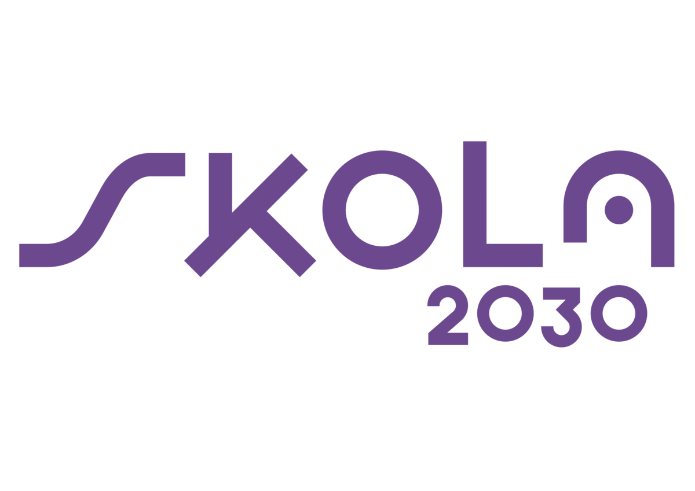
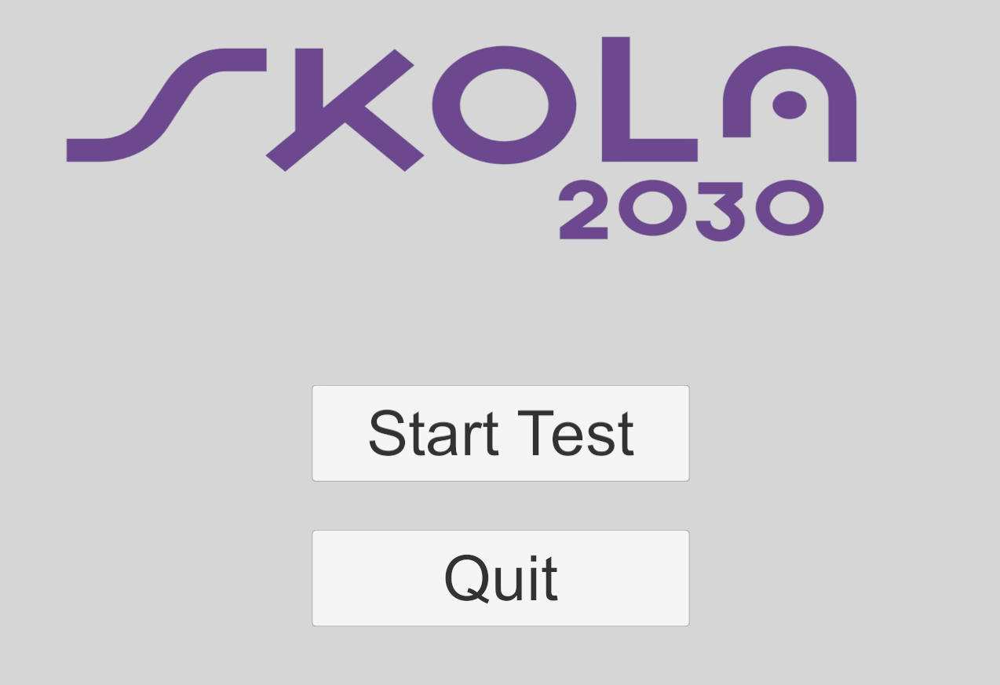
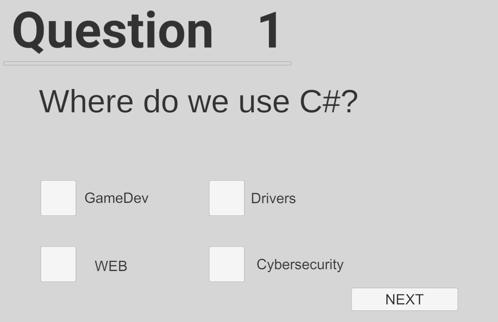

# Variables, their data types, basic operations for work, working with them with the C# programming language in the Unity engine (29)
This is a exam work about variables and objects in Unity.   
**Project contains:**
  - Teaching material
  - UML diagrams
    
  - Program to test knowledges about this theme
    
    

